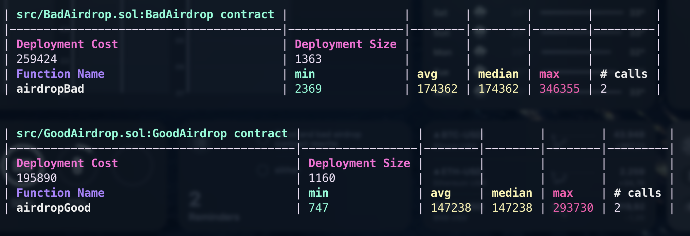

# Airdrop

This repository contains two Solidity contracts, `GoodAirdrop.sol` and `BadAirdrop.sol`, which are used to perform airdrops of ERC20 tokens to multiple recipients.

## GoodAirdrop

The `GoodAirdrop` contract is designed to perform airdrops in a more gas efficent way. The contract takes in an array of recipient addresses and an array of token amounts, and transfers the specified amounts from the sender to the recipients. The contract ensures that the lengths of the recipients and amounts arrays are equal, and reverts the transaction if they are not.

## BadAirdrop

The `BadAirdrop` contract, on the other hand, is an example of how not to perform airdrops. The contract transfers tokens from the sender to the contract itself, and then from the contract to the recipients. This is inefficient and may cost more gas, as it loops twice.

## Usage

To use these contracts, you will need to provide the address of the ERC20 token you wish to airdrop when deploying the contract. Then, to perform an airdrop, call the `airdrop` function with an array of recipient addresses and an array of token amounts.

## Testing

To test the contract and the gas it used run this commands:
``` bash
forge test --gas-report
```


## Dependencies

These contracts depend on the OpenZeppelin Contracts library for the ERC20 interface. You will need to install this library using npm with the command `forge install OpenZeppelin/openzeppelin-contracts --no-commit`.

## Notes

These contracts are taken from [PopPunk](https://twitter.com/PopPunkOnChain) gas optimization example in Cyfrin Updraft.
